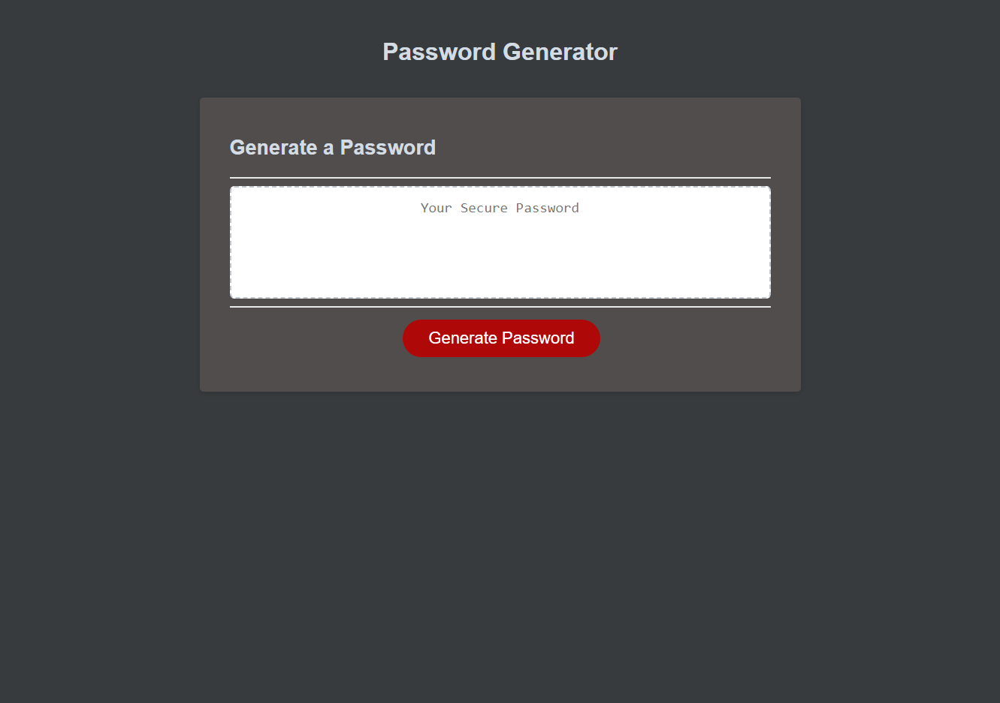

# JavaScript Password Generator
This page contains a password generator to enable to user to automatically create a secure password at the press of a button following completion of a series of prompts. It can generate passwords using any combination of lowercase or uppercase letters, numbers, and a few special characters between eight and 128 characters in length.

## Application
The homepage can be viewed [here](https://chocochip287.github.io/js-password-generator/).

## Screenshot
